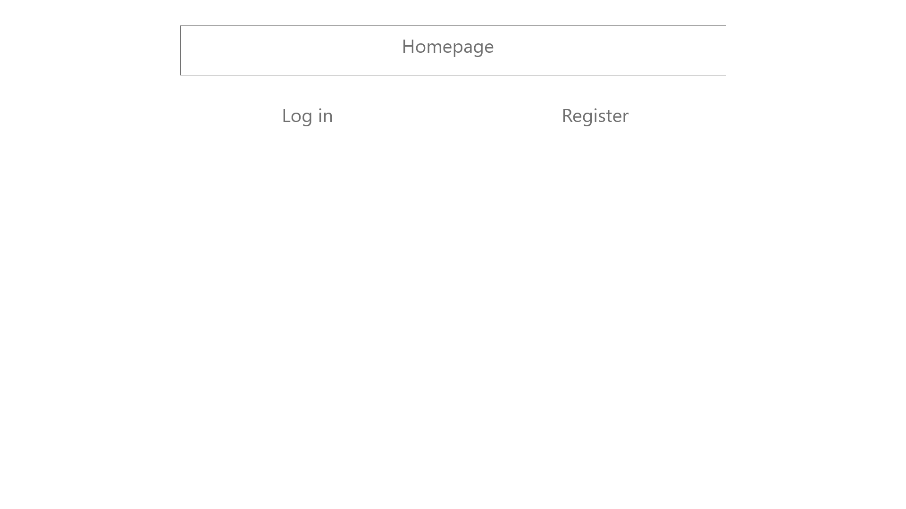
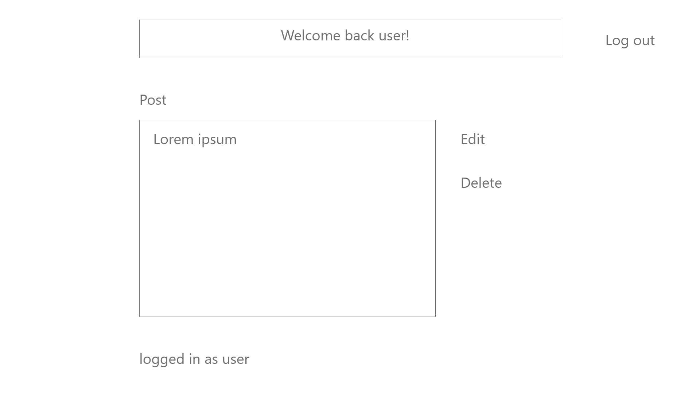
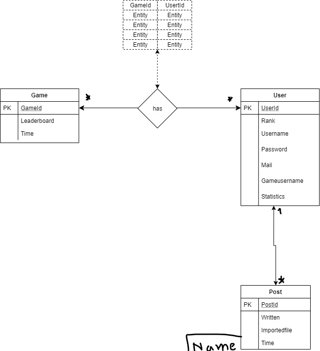
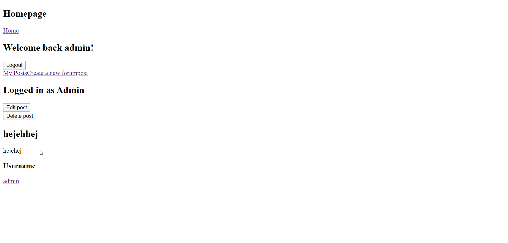
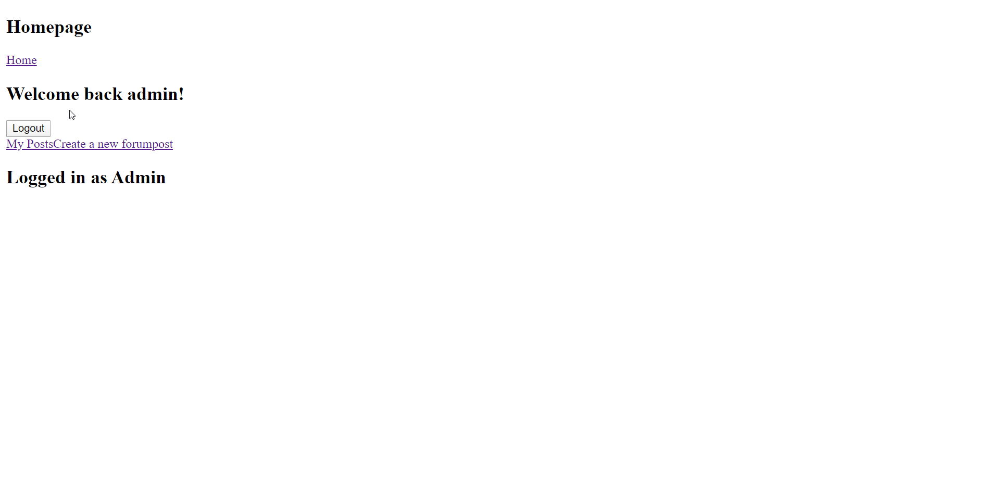
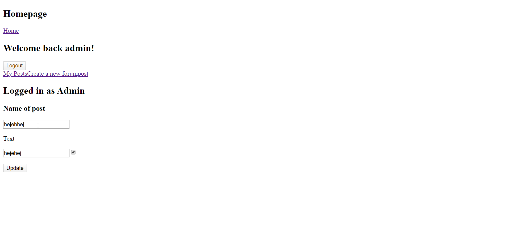
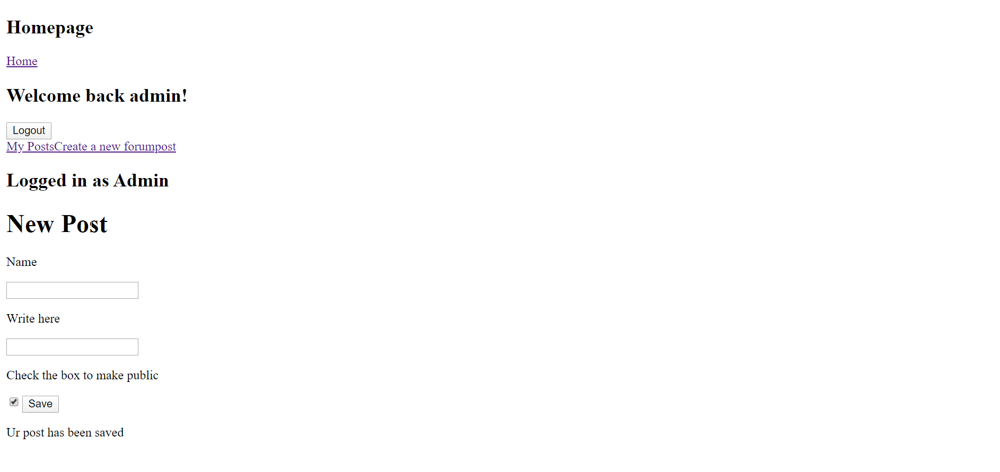
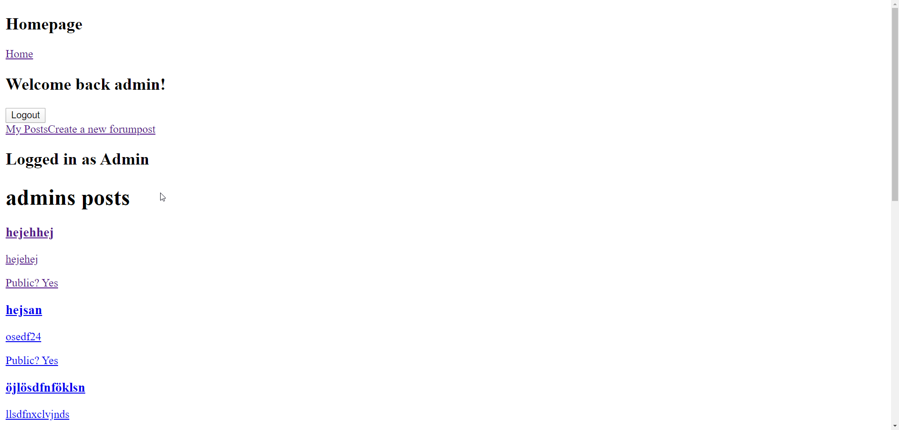

# Projektplan

## 1. Projektbeskrivning
* På sidan ska användare lägga upp forumpost på spelet som de spelar.
## 2. Vyer
### Skiss på landingpage

### Skiss på en inloggad

### Skiss på en enstaka post

## 3. Databas med ER-diagram 

ps. Detta Er-diagrammet är inte exakt, det är ganska gammalt
## 4. Arkitektur
__Mappar:__

public - Innehåller alla publika filer
* js 
* img - Innehåller en undermapp med alla bilder

* css - Innehåller stilarket av sidan

views - Innehåller alla restful routes slim filer
* posts - Innehåller slim filer för annons relaterade händelser
* users - Innehåller slim filer för användar relaterade händelser

__Filer:__

app.rb - Huvuddelen i projektet där alla routes finns

model.rb - Inehåller alla databas förfrågningar + validering av information

## 5. Resultat

